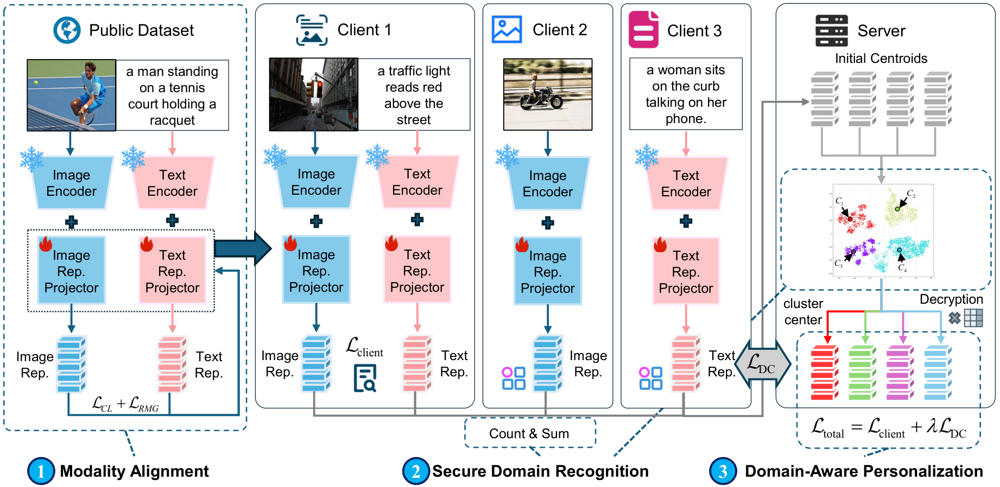

# FedMMDP: A Federated Multimodal Domain Personalization Framework with Modality Alignment and Privacy Preservation

This is the official research implementation accompanying **FedMMDP: A Federated Multimodal Domain Personalization Framework with Modality Alignment and Privacy Preservation**, accepted at **ACM Multimedia 2026 (MM '26)**.

**Authors:** Shuai Zhang, Shengze Hu, Xiongtao Zhang, Jingxuan Zhou, Weidong Bao, and Ji Wang.

**Paper:** [ACM Digital Library / DOI: 10.1145/3767308.3835427](https://doi.org/10.1145/3767308.3835427).

FedMMDP studies multimodal federated learning with modality-aligned initialization, domain recognition from aggregated statistics, and centroid-guided personalization. See [Implementation Scope](#implementation-scope) for the aggregation backend provided by this codebase and [Citation](#citation) for the paper reference and BibTeX entry.

## Overview

The method targets heterogeneous federated settings with image-only, text-only, and multimodal clients. The implementation follows the same three-stage design described in the accompanying paper:



1. **Modality alignment**: a lightweight projector is pretrained on public multimodal data to reduce the image-text modality gap before federated optimization.
2. **Domain recognition from sufficient statistics**: clients compute local cluster sums and counts, and the server updates centroids from their aggregate. The paper specifies secure aggregation; this repository provides a plaintext simulation of the aggregation interface.
3. **Centroid-guided personalization**: the updated centroids are used as domain-aware guidance during local multimodal optimization.

## Main Contributions Implemented in This Repository

- A modality-aligned initialization pipeline for multimodal federated learning.
- A Lloyd-style centroid update procedure for domain discovery from aggregated client statistics.
- A domain-aware personalized training objective for heterogeneous multimodal clients.

## Implementation Scope

The current [`SecureAggregator`](src/algorithms/secure_agg.py) is an **interface-compatible plaintext placeholder**. It receives individual client sums and counts and adds them to obtain global statistics. It does not implement cryptographic masking, key exchange, or protection of individual client statistics from the aggregation process. The code supports algorithm experiments with aggregated statistics; cryptographic privacy guarantees and secure-protocol overhead require a separate secure-aggregation backend and evaluation.

The four main `baselines_*.sh` launchers disable RMG during federated optimization with `--fedmmdp_disable_rmg_loss 1`, matching the paper's use of RMG during projector pretraining. They default to 50 communication rounds, one local epoch per round, batch size 256, and learning rate `1e-5`. Direct command-line defaults and ablation launchers can use different settings; record the full launch configuration, seed, data partition, and projector checkpoint for each experiment.

## Repository Layout

```text
.
+-- src/
|   +-- algorithms/        # Federated algorithms and trainers
|   +-- datasets/          # Dataset loaders and preprocessing interfaces
|   +-- networks/          # Encoders, projector training, and model components
|   `-- utils/             # Shared helpers, naming utilities, and configs
+-- docs/
|   `-- framework.png      # Paper framework figure for project overview
+-- baselines_*.sh         # Baseline launch scripts for each benchmark setting
+-- run_fedmmdp_ablation_case.sh
+-- pretrain_projector_loss_ablation.sh
`-- README.md
```

## Environment Setup

Create a Python environment with the dependencies required by the project, then activate it before running any script. The tracked scripts use generic defaults and do not expose machine-specific paths or environment names.

## Local Private Configuration

To keep local server paths and environment names available **without uploading them to GitHub**, this repository supports a private override file:

```bash
cp config/local_paths.example.sh config/local_paths.sh
```

Then edit `config/local_paths.sh` with your local values. The launcher scripts automatically source this file when it exists, and `.gitignore` excludes it from version control.

Typical variables include:

- `CONDA_BIN`
- `ENV_NAME`
- `FEDMMDP_COCO_ROOT`
- `FEDMMDP_FLICKR30K_ROOT`
- `FEDMMDP_IMAGENET_ROOT`
- `FEDMMDP_IAPR_ROOT`
- `FEDMMDP_IMAGENET_SIGLIP_ROOT`
- `FEDMMDP_IAPR_SIGLIP_ROOT`

## Expected Data Layout

The public repository assumes configurable dataset locations. One convenient layout is:

```text
data/
+-- COCO/
|   +-- annotations/
|   +-- train2017/
|   `-- val2017/
+-- flickr30k/
|   `-- flickr30k-images/
+-- imagenet/
|   `-- domain_datasets/
+-- iapr/
|   `-- domain_datasets/
`-- iapr_siglip/
    `-- domain_datasets/
```

You can also store the datasets elsewhere and point the scripts to them via `config/local_paths.sh` or environment variables.

## Running Main Experiments

Examples:

```bash
bash baselines_imagenet.sh
bash baselines_iapr.sh
bash baselines_siglip.sh
bash baselines_iapr_siglip.sh
```

These scripts launch the baseline suite and the FedMMDP configuration for the corresponding setting.

## Running Ablations

Run a single ablation case:

```bash
GPU=0 \
DATASET=imagenet \
MODEL=clip \
DATA_ROOT=data/imagenet/domain_datasets \
USE_PRETRAINED_PROJ=1 \
COMM_ROUNDS=50 \
ABLATION=wo_cluster \
bash run_fedmmdp_ablation_case.sh
```

Convenience launchers are also provided:

```bash
bash ablation_clip_core.sh
bash ablation_siglip_support.sh
bash ablation_final_imagenet_clip_preproj.sh
```

## Projector Pretraining

Examples:

```bash
bash pretrain_projector_loss_ablation.sh clip
bash pretrain_projector_loss_ablation.sh siglip
```

The projector training scripts support multiple objective variants, including `cl_rmg`, `cl_only`, `rmg_only`, and `max_margin`.

## Citation

If you use FedMMDP or build on this implementation, please cite:

Shuai Zhang, Shengze Hu, Xiongtao Zhang, Jingxuan Zhou, Weidong Bao, and Ji Wang. 2026. FedMMDP: A Federated Multimodal Domain Personalization Framework with Modality Alignment and Privacy Preservation. In *Proceedings of the 34th ACM International Conference on Multimedia (MM '26)*, November 10--14, 2026, Rio de Janeiro, Brazil. ACM, New York, NY, USA, 9 pages. https://doi.org/10.1145/3767308.3835427

```bibtex
@inproceedings{zhang2026fedmmdp,
  title     = {{FedMMDP}: A Federated Multimodal Domain Personalization Framework with Modality Alignment and Privacy Preservation},
  author    = {Zhang, Shuai and Hu, Shengze and Zhang, Xiongtao and Zhou, Jingxuan and Bao, Weidong and Wang, Ji},
  booktitle = {Proceedings of the 34th ACM International Conference on Multimedia},
  series    = {MM '26},
  year      = {2026},
  publisher = {Association for Computing Machinery},
  address   = {New York, NY, USA},
  location  = {Rio de Janeiro, Brazil},
  numpages  = {9},
  doi       = {10.1145/3767308.3835427},
  url       = {https://doi.org/10.1145/3767308.3835427}
}
```
